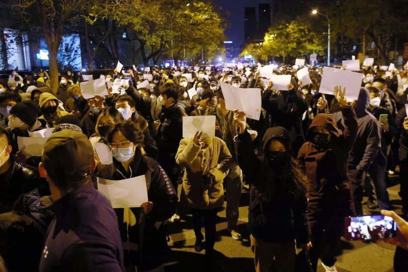

```{r setup, include=FALSE}
library(tidyverse)
library(knitr)
library(learnr)
library(kableExtra)
library(estimatr)
library(ggthemes)
library(modelsummary)

knitr::opts_chunk$set(echo = FALSE)
knitr::opts_chunk$set(message = FALSE)
knitr::opts_chunk$set(warning = FALSE)
knitr::opts_chunk$set(error = FALSE)

# set default chart theme
theme_set(theme_tufte())

load(file="www/privacy.attitudes.RData")

Ones <- function(x) table(x)[1]
Twos <- function(x) table(x)[2]
Threes <- function(x) table(x)[3]
Fours <- function(x) table(x)[4]
Fives <- function(x) table(x)[5]
Sixes <- function(x) table(x)[6]
Sevens <- function(x) table(x)[7]

replace_estimates <- function(mod_list_func) {
  
  working <- mod_list_func
  
  for(model in 1:length(working)) {
    for(obs in 1:nrow(working[[model]]$tidy)) {
      working[[model]]$tidy$estimate[obs] <- case_when(working[[model]]$tidy$p.value[obs] > 0.05 ~ "—",
                                working[[model]]$tidy$estimate[obs] >= 0 ~ "▲",
                                working[[model]]$tidy$estimate[obs] < 0 ~ "▼")
    }
  }
  
  return(working)
}
```


## Where to find this research

```{r qrcode, out.width = "50%", fig.cap="QR code for this presentation"}

```

Presentation website: https://bit.ly/viennaprivacy

[Github repository](https://github.com/andrewmacd/wp-privacyattitudes)

[Working paper](https://github.com/andrewmacd/wp-privacyattitudes/blob/main/Working%20paper/Learning-to-love-big-brother-wp.pdf)

## Why this project?

```{r whyproject, out.width = "100%", fig.cap="CCTV cameras near Tiananmen Square^[Image credit: https://www.cnbc.com/2020/02/25/coronavirus-china-to-boost-mass-surveillance-machine-experts-say.html]"}

```

## What are the goals of this project?

* How should we expect Chinese to feel about online privacy?
* Not obvious!
* How did Covid change things?
* Also not obvious!

```{r goals, out.width = "100%", fig.cap="Covid-era health code^[Image credit: https://edition.cnn.com/2020/04/15/asia/china-coronavirus-qr-code-intl-hnk/index.html]"}
knitr::include_graphics("www/healthcode.jpeg")
```

## How Chinese feel about being monitored?

### Authoritarian priors

```{r fastslow, out.width = "100%", fig.cap="Still shot from the film Lives of Others^[Image credit: https://www.opendemocracy.net/en/stasi_4455jsp/]"}
knitr::include_graphics("www/livesofothers.jpg")
```

### No concern for privacy though?

>"I think Chinese people are more open, or are not that sensitive about privacy. If they are able to exchange privacy for safety, convenience, or efficiency, in many cases they are willing to do that. Then we can make more use of that data"

```{r robinli, out.width = "100%", fig.cap="Robin Li, founder of Baidu^[Image credit: https://www.scmp.com/abacus/tech/article/3028715/baidus-ceo-robin-li-isnt-afraid-googles-rumored-comeback-china]"}
knitr::include_graphics("www/robinli.jpeg")
```

```{r communistprivacy, out.width = "100%", fig.cap="Dining in a People's Commune^[Image credit: https://en.wikipedia.org/wiki/People%27s_commune]"}
knitr::include_graphics("www/commune.jpeg")
```

### Chinese trust their government

```{r trust, out.width = "100%", fig.cap="Measure of trust in Chinese government^[Image credit: Wu et. al. https://doi.org/10.1080/10670564.2021.1893558]"}

```

### Covid was a possible game changer

```{r whitepaper, out.width = "100%", fig.cap="White paper protestors in Beijing^[Image credit: https://www.upi.com/Top_News/World-News/2022/11/28/Xi-Jinping-protests-Beijing-Shanghai-white-paper-lockdowns-COVID-19/8941669623371/]"}

```

## Project design and goals

### Data collection

* Wave 1: March 2021, n=1500

```{r wave1, out.width = "50%", fig.cap="Wuhan before and after the lockdown^[Image credits: https://www.japantimes.co.jp/news/2020/04/06/asia-pacific/china-wuhan-lockdown-coronavirus/, https://mixmag.net/read/thousands-music-festival-wuhan-water-park-news]", fig.show='hold',fig.align='left'}
knitr::include_graphics(c("www/wuhanlockdown.jpeg", "www/wuhanparty.jpeg"))
```

* Wave 2: March 2023, n=2000

```{r wave2, out.width = "100%", fig.cap="Shanghai mass Covid testing^[Image credit: https://www.bbc.com/news/world-asia-china-61307148]"}

```

### Hypotheses

- $\mathbf{H1_a}: government\:monitoring \rightarrow high\:citizen\:privacy\:concern$
  + *Reason*: Distrust in authoritarian regimes
- $\mathbf{H1_b}: any\:type\:of\:monitoring \rightarrow low\:citizen\:privacy\:concern$
  + *Reason*: Historical lack of privacy; culture
- $\mathbf{H1_c}: government\:monitoring \rightarrow low\:citizen\:privacy\:concern$
  + *Reason*: High level of trust in government
- $\mathbf{H2}: 2021\:to\:2023 \rightarrow trust\:in\:government\downarrow$
  + *Reason*: Covid effects
- $\mathbf{H2_b}: 2021\:to\:2023 \rightarrow acceptance\:of\:goverment\:monitoring\downarrow$
  + *Reason*: Covid effects
- $\mathbf{H3}: Living\:in\:city\:hit\:hard\:by\:Covid \rightarrow trust\:and\:monitoring\:acceptance\downarrow$ 
  + *Reason*: Heterogeneous effects?

## Results

### Simple results - trust and monitoring acceptance

Trust and monitoring acceptance questions

```{r trustandacceptanceqs}
table.text <- list()

table.text[[1]] <- c("Q1", "Overall, I’m happy with the performance of the central government")
table.text[[2]] <- c("Q2", "Overall, I’m happy with the performance of my local government")
table.text[[3]] <- c("Q3", "The government does a good job balancing the rights of citizens to be free of surveillance in their daily lives with the need to preserve order and prevent crime.")
table.text[[4]] <- c("Q4", "Government performance index")

gp.text <- data.frame()

for(line in table.text) {
  gp.text <- rbind(gp.text, line)
}

kbl(gp.text, col.names = NULL) %>% 
  kable_styling()
```

Trust and monitoring acceptance data

```{r trustandacceptancedata}
#| label: tbl-gp.summary.data
#| tbl-cap: Government performance data

gp.qs <- privacy %>% 
  mutate(gp1 = as.numeric(gp1)) %>% 
  mutate(gp2 = as.numeric(gp2)) %>% 
  mutate(gp3 = as.numeric(gp3)) %>% 
  select(`Central government performance` = gp1,
         `Local government performance` = gp2,
         `Government performance Q3` = gp3,
         `Government performance index` = gp.index,
         `Year` = year) 

datasummary_balance(~ Year, data=gp.qs, dinm_statistic = "p.value",
                    fmt=fmt_sprintf("%.2f"))
```

### Simple results - OK to be tracked

OK to track questions

```{r oktotrackqs}
table.text <- list()

table.text[[1]] <- c("Q1", "There are good reasons for the central government to monitor the activity of users online")
table.text[[2]] <- c("Q2", "There are good reasons for the local government to monitor the activity of users online")
table.text[[3]] <- c("Q3", "There are good reasons for private companies to monitor the activity of users online")
table.text[[4]] <- c("Q4", "It doesn’t bother me to provide the government with biometric information including my fingerprints and face details for the purposes of monitoring public places")
table.text[[5]] <- c("Q5", "It doesn’t bother me to provide private companies with biometric information including my fingerprints and face details for the purposes of monitoring public places")
table.text[[6]] <- c("Q6", "Government monitoring index of Q1 + Q2 + Q4")
table.text[[7]] <- c("Q7", "Private monitoring index of Q3 + Q5")
table.text[[8]] <- c("Q8", "Total monitoring index of Q1-Q5")

gm.text <- data.frame()

for(line in table.text) {
  gm.text <- rbind(gm.text, line)
}

kbl(gm.text, col.names = NULL) %>% 
  kable_styling()
```

OK to track data

```{r oktotrackdata}
gm.qs <- privacy %>% 
  mutate(gm1 = as.numeric(gm1)) %>% 
  mutate(gm2 = as.numeric(gm2)) %>% 
  mutate(gm3 = as.numeric(gm3)) %>% 
  mutate(gm4 = as.numeric(gm4)) %>% 
  mutate(gm5 = as.numeric(gm5)) %>% 
  select(`Central government monitoring` = gm1,
         `Local government monitoring` = gm2,
         `Private company monitoring` = gm3,
         `Government biometric monitoring` = gm4,
         `Private biometric monitoring` = gm5,
         `Government monitoring index` = gm.index.gov,
         `Private monitoring index` = gm.index.priv,
         `Total monitoring index` = gm.index.total,
         `Year` = year) 

datasummary_balance(~ Year, data=gm.qs, dinm_statistic = "p.value",
                    fmt=fmt_sprintf("%.2f"))
```

### Simple results - awareness of tracking

Awareness of tracking questions

```{r awarenessoftrackingqs}
table.text <- list()

table.text[[1]] <- c("Q1", "How closely do you think the central government tracks your online activity?")
table.text[[2]] <- c("Q2", "How closely do you think the local government tracks your online activity?")
table.text[[3]] <- c("Q3", "How closely do you think private companies track your online activity?")
table.text[[4]] <- c("Q4", "How comfortable are you with the central government knowing personal details about your activity online?")
table.text[[5]] <- c("Q5", "How comfortable are you with the local government knowing personal details about your activity online?")
table.text[[6]] <- c("Q6", "How comfortable are you with private companies knowing personal details about your activity online?")

track.text <- data.frame()

for(line in table.text) {
  track.text <- rbind(track.text, line)
}

kbl(track.text, col.names = NULL) %>% 
  kable_styling()
```

Awareness of tracking data

```{r awarenesstrackingdata}
track.qs <- privacy %>% 
  mutate(track1 = as.numeric(track1)) %>% 
  mutate(track2 = as.numeric(track2)) %>% 
  mutate(track3 = as.numeric(track3)) %>% 
  mutate(track4 = as.numeric(track4)) %>% 
  mutate(track5 = as.numeric(track5)) %>%
  mutate(track6 = as.numeric(track6)) %>% 
  select(`Central government tracking - prevalence` = track1,
         `Local government tracking - prevalence` = track2,
         `Private company tracking - prevalence` = track3,
         `Central government tracking - comfort` = track4,
         `Local govenrment tracking - comfort` = track5,
         `Private company tracking - comfort` = track6,
         `Year` = year) 

datasummary_balance(~ Year, data=track.qs, dinm_statistic = "p.value",
                    fmt=fmt_sprintf("%.2f"))
```

### Simple results - additional questions

Additional questions 

```{r additionalqs}
table.text <- list()

table.text[[1]] <- c("Q1", "I don’t notice government use of technology to monitor my behavior in my daily life.")
table.text[[2]] <- c("Q2", "The government is likely to securely store my online personal data and  information better than private companies.")
table.text[[3]] <- c("Q3", "It doesn’t bother me if private companies sell my user data to third parties if it will allow me to use their applications for free.")
table.text[[4]] <- c("Q4", "I’m worried that my payment information might be stolen or compromised.")

misc.text <- data.frame()

for(line in table.text) {
  misc.text <- rbind(misc.text, line)
}

kbl(misc.text, col.names = NULL) %>% 
  kable_styling()
```

Additional questions data

```{r additionaldata}
misc.qs <- privacy %>% 
  mutate(misc3 = as.numeric(misc3)) %>% 
  mutate(misc4 = as.numeric(misc4)) %>% 
  mutate(misc5 = as.numeric(misc5)) %>%
  mutate(misc6 = as.numeric(misc6)) %>% 
  select(`Do not notice government tracking` = misc3,
         `Government secures data better than private` = misc4,
         `OK if apps sell my data so can use for free` = misc5,
         `Payment data stolen worries` = misc6,
         `Year` = year) 

datasummary_balance(~ Year, data=misc.qs, dinm_statistic = "p.value",
                    fmt=fmt_sprintf("%.2f"))
```

### List experiment results

List experiment questions

```{r listexpmainqs}
table.text <- list()

table.text[[1]] <- c("Q1", "For the question below, please count how many of the entities listed below you would\ntrust with your online personal information, such as details about your purchase history, your browsing habits, and your social media posts<br> 
<br>
• Alibaba<br>
• Tencent<br>
• Foreign internet companies (such as Microsoft)<br>
• Your family<br>
->Sensitive item only shown to 50 per cent of respondents<br>
• The central government")

table.text[[2]] <- c("Q2", "For the question below, please count how many of the entities listed below you would trust with your online personal information, such as details #about your purchase history, your browsing habits, and your social media posts<br>
<br>
•	Alibaba<br>
•	Tencent<br>
•	Foreign internet companies (such as Microsoft)<br>
•	Your family<br>
->Sensitive item only shown to 50 per cent of respondents<br>
•	The local government")

listexp.text <- data.frame()

for(line in table.text) {
  listexp.text <- rbind(listexp.text, line)
}

kable(listexp.text, col.names = NULL) %>% 
  kable_styling()
```

List experiment data

```{r listexpmaindata}
listexp.qs <- privacy %>% 
  mutate(le.num = as.numeric(le.num),
         le.5th.shown = factor(le.5th.shown, labels=c("SI not shown", "SI shown"))) %>% 
  select(`Number of items selected` = le.num,
         `Group` = le.group,
         `Shown` = le.5th.shown,
         `Year` = year) 

centralgov.qs <- listexp.qs %>% 
  filter(as.numeric(Group) == 2) %>% 
  select(c(`Number of items selected`, 
           `Shown`,
           `Year`))

datasummary(`Number of items selected` ~ mean * Year * Shown,
                    data=centralgov.qs,
                    title="Central government list experiment",
                    notes=c("SI = sensitive item")) %>% 
  kable_styling(latex_options = c("striped"))

localgov.qs <- listexp.qs %>% 
  filter(as.numeric(Group) == 3) %>% 
  select(c(`Number of items selected`, 
           `Shown`,
           `Year`))

datasummary(`Number of items selected` ~ mean * Year * Shown,
                    data=localgov.qs,
                    title="Local government list experiment",
                    notes=c("SI = sensitive item"))
```

## Advanced analysis

### Regression results - trust

```{r regtrustandacceptmain}
reg.data <- privacy %>% 
  mutate(education = factor(case_when(education=="No formal education" ~ "Less than middle",
                                      education=="Primary" ~ "Less than middle",
                                      education=="Middle school" ~ "Middle school",
                                      education=="High school" ~ "High school",
                                      education=="University" ~ "University",
                                      education=="Advanced studies/Graduate school" ~ "Advanced studies/Graduate school"), 
                            levels=c("Less than middle", 
                                     "Middle school",
                                     "High school",
                                     "University",
                                     "Advanced studies/Graduate school")))

mod1 <- lm(data=reg.data, as.numeric(gp1) ~ age + education + income + sex  
           + party.member.status + location + year)
mod2 <- lm(data=reg.data, as.numeric(gp2) ~ age + education + income + sex 
           + party.member.status + location + year)
mod3 <- lm(data=reg.data, as.numeric(gm1) ~ age + education + income + sex  
           + party.member.status + location + year)
mod4 <- lm(data=reg.data, as.numeric(gm2) ~ age + education + income + sex  
           + party.member.status + location + year)
mod5 <- lm(data=reg.data, as.numeric(gm3) ~ age + education + income + sex  
           + party.member.status + location + year)

models <- list(
  "CG Trust"     = mod1,
  "LG Trust"     = mod2,
  "CG Monitor"   = mod3,
  "LG Monitor"   = mod4,
  "PR Monitor"   = mod5
)

mod_list_soc <- modelsummary(models, output = "modelsummary_list")
mod_list_soc_update <- as.list(mod_list_soc)
mod_list_soc_update <- replace_estimates(mod_list_soc_update)

n <- "▲, ▼ indicates p>0.05"

modelsummary(mod_list_soc_update, coef_rename = c("age" = "Age",
                                     "educationMiddle school" = "Middle school",
                                     "educationHigh school" = "High school",
                                     "educationUniversity" = "University",
                                     "educationAdvanced studies/Graduate school" = "Grad school",
                                     "income3,000-5,999" = "Income 3000-5999",
                                     "income6,000-9,999" = "Income 6000-9999",
                                     "income10,000-19,999" = "Income 10000-19999",
                                     "income20,000-49,999" = "Income 20000-49999",
                                     "income50,000-99,999" = "Income 50000-99999",
                                     "incomeMore than 100,000" = "Income > 100000",
                                     "sexMale" = "Male",
                                     "party.member.statusNo" = "Not a party member",
                                     "locationSmall city" = "Location: small city",
                                     "locationMid-sized city" = "Location: mid city",
                                     "locationBig city" = "Location: big city",
                                     "year2023" = "Year 2023"),
             statistic = NULL,
             gof_omit = 'AIC|BIC|RMSE|Log.Lik.|R2 Adj.',
             notes = list("Reference categories are Less than middle, Income 0-2999, Female, Party member, Countryside", n))
```

### Regression results - tracking and data use

```{r regtrackingdatausemain}
reg.tracking.data <- privacy %>% 
  mutate(education = factor(case_when(education=="No formal education" ~ "Less than middle",
                                      education=="Primary" ~ "Less than middle",
                                      education=="Middle school" ~ "Middle school",
                                      education=="High school" ~ "High school",
                                      education=="University" ~ "University",
                                      education=="Advanced studies/Graduate school" ~ "Advanced studies/Graduate school"), 
                            levels=c("Less than middle", 
                                     "Middle school",
                                     "High school",
                                     "University",
                                     "Advanced studies/Graduate school")))

mod1 <- lm(data=reg.tracking.data, as.numeric(track1) ~ age + education + income + sex  
           + party.member.status + location + year)
mod2 <- lm(data=reg.tracking.data, as.numeric(track2) ~ age + education + income + sex 
           + party.member.status + location + year)
mod3 <- lm(data=reg.tracking.data, as.numeric(track3) ~ age + education + income + sex  
           + party.member.status + location + year)
mod4 <- lm(data=reg.tracking.data, as.numeric(track4) ~ age + education + income + sex  
           + party.member.status + location + year)
mod5 <- lm(data=reg.tracking.data, as.numeric(track5) ~ age + education + income + sex  
           + party.member.status + location + year)
mod6 <- lm(data=reg.tracking.data, as.numeric(track6) ~ age + education + income + sex  
           + party.member.status + location + year)

models <- list(
  "CG Track" = mod1,
  "LG Track" = mod2,
  "PR Track" = mod3,
  "CG PD"    = mod4,
  "LG PD"    = mod5,
  "PR PD"    = mod6
)

mod_list_soc <- modelsummary(models, output = "modelsummary_list")
mod_list_soc_update <- as.list(mod_list_soc)
mod_list_soc_update <- replace_estimates(mod_list_soc_update)

n <- "▲, ▼ indicates p>0.05"

modelsummary(mod_list_soc_update, coef_rename = c("age" = "Age",
                                     "educationMiddle school" = "Middle school",
                                     "educationHigh school" = "High school",
                                     "educationUniversity" = "University",
                                     "educationAdvanced studies/Graduate school" = "Grad school",
                                     "income3,000-5,999" = "Income 3000-5999",
                                     "income6,000-9,999" = "Income 6000-9999",
                                     "income10,000-19,999" = "Income 10000-19999",
                                     "income20,000-49,999" = "Income 20000-49999",
                                     "income50,000-99,999" = "Income 50000-99999",
                                     "incomeMore than 100,000" = "Income > 100000",
                                     "sexMale" = "Male",
                                     "party.member.statusNo" = "Not a party member",
                                     "locationSmall city" = "Location: small city",
                                     "locationMid-sized city" = "Location: mid city",
                                     "locationBig city" = "Location: big city",
                                     "year2023" = "Year 2023"),
             gof_omit = 'AIC|BIC|RMSE|Log.Lik.|R2 Adj.',
             statistic = NULL,
             notes = list("Reference categories are Less than middle, Income 0-2999, Female, Party member, Countryside", n))
```

### By city

Trust and monitoring acceptance by city

```{r regcityfirstqsmain}
attitude.detail.qs <- privacy %>% 
  mutate(gp1 = as.numeric(gp1)) %>% 
  mutate(gp2 = as.numeric(gp2)) %>% 
  mutate(gm1 = as.numeric(gm1)) %>% 
  mutate(gm2 = as.numeric(gm2)) %>% 
  mutate(gm3 = as.numeric(gm3)) %>% 
  mutate(track1 = as.numeric(track1)) %>% 
  mutate(track2 = as.numeric(track2)) %>% 
  mutate(track3 = as.numeric(track3)) %>% 
  mutate(track4 = as.numeric(track4)) %>% 
  mutate(track5 = as.numeric(track5)) %>% 
  mutate(track6 = as.numeric(track6)) %>% 
  mutate(city = factor(case_when(province=="Shanghai" ~ "Shanghai",
                                 grepl("武汉市", city) ~ "Wuhan",
                                 grepl("西安市", city) ~ "Xi'an",
                                 TRUE ~ "Other cities"),
                       levels=c("Other cities", "Shanghai", "Xi'an", "Wuhan")))

mod1 <- lm(data=attitude.detail.qs, gp1 ~ city + year + city*year)
mod2 <- lm(data=attitude.detail.qs, gp2 ~ city + year + city*year)
mod3 <- lm(data=attitude.detail.qs, gm1 ~ city + year + city*year)
mod4 <- lm(data=attitude.detail.qs, gm2 ~ city + year + city*year)
mod5 <- lm(data=attitude.detail.qs, gm3 ~ city + year + city*year)

models <- list(
  "CG Trust"     = mod1,
  "LG Trust"     = mod2,
  "CG Monitor"   = mod3,
  "LG Monitor"   = mod4,
  "PR Monitor"   = mod5
)

mod_list_soc <- modelsummary(models, output = "modelsummary_list")
mod_list_soc_update <- as.list(mod_list_soc)
mod_list_soc_update <- replace_estimates(mod_list_soc_update)

n <- "▲, ▼ indicates p>0.05"

modelsummary(mod_list_soc_update,
             coef_rename = c("cityShanghai" = "Shanghai",
                             "cityXi'an" = "Xi'an",
                             "cityWuhan" = "Wuhan",
                             "year2023" = "2023",
                             "cityShanghai:year2023" = "Shanghai x 2023",
                             "cityXi'an:year2023" = "Xi'an x 2023",
                             "cityWuhan:year2023" = "Wuhan x 2023"),
             gof_omit = 'AIC|BIC|RMSE|Log.Lik.|R2 Adj.|R2|Num.Obs.',
             statistic = NULL,
             notes = list(n))
```

Tracking awareness and personal data use comfort by city

```{r regcitysecondqsmain}
mod1 <- lm(data=attitude.detail.qs, track1 ~ city + year + city*year)
mod2 <- lm(data=attitude.detail.qs, track2 ~ city + year + city*year)
mod3 <- lm(data=attitude.detail.qs, track3 ~ city + year + city*year)
mod4 <- lm(data=attitude.detail.qs, track4 ~ city + year + city*year)
mod5 <- lm(data=attitude.detail.qs, track5 ~ city + year + city*year)
mod6 <- lm(data=attitude.detail.qs, track6 ~ city + year + city*year)

models <- list(
  "CG Track" = mod1,
  "LG Track" = mod2,
  "PR Track" = mod3,
  "CG PD"    = mod4,
  "LG PD"    = mod5,
  "PR PD"    = mod6
)

mod_list_soc <- modelsummary(models, output = "modelsummary_list")
mod_list_soc_update <- as.list(mod_list_soc)
mod_list_soc_update <- replace_estimates(mod_list_soc_update)

n <- "▲, ▼ indicates p>0.05"

modelsummary(mod_list_soc_update,
             coef_rename = c("cityShanghai" = "Shanghai",
                             "cityXi'an" = "Xi'an",
                             "cityWuhan" = "Wuhan",
                             "year2023" = "2023",
                             "cityShanghai:year2023" = "Shanghai x 2023",
                             "cityXi'an:year2023" = "Xi'an x 2023",
                             "cityWuhan:year2023" = "Wuhan x 2023"),
             gof_omit = 'AIC|BIC|RMSE|Log.Lik.|R2 Adj.|R2|Num.Obs.',
             statistic = NULL,
             notes = list(n))
```

## Implications and concluding thoughts

* White Paper Revolution only a specific grievance
* Shanghai the exception
* Citizens very suspicious of corporations not of government
* Others?? Help me out!

## Appendix - run your own code

### Demographics

Demographic questions

```{r demographicsqs, exercise=TRUE}
table.text <- list()

table.text[[1]] <- c("Q1", "Which of these best describes the place in which you live?")
table.text[[2]] <- c("Q2", "What province do you live in?")
table.text[[3]] <- c("Q3", "How old are you?")
table.text[[4]] <- c("Q4", "What is the highest level of education that you have obtained?")
table.text[[5]] <- c("Q5", "Gender")
table.text[[6]] <- c("Q6", "Marital Status")
table.text[[7]] <- c("Q7", "Which of the following best describes the type of job you have?")
table.text[[8]] <- c("Q8", "Which of the following best describes the type of company or work unit you work for?")
table.text[[9]] <- c("Q9", "Are you a member or probationary member of the CCP?")
table.text[[10]] <- c("Q10", "Are you a member of the Communist Youth League?")
table.text[[11]] <- c("Q11", "Here is a table showing the range of monthly incomes that people have. Which of the letters on this table best represents the total monthly income of your household (after tax)?")
table.text[[12]] <- c("Q12", "What is your residency status?")

demo.text <- data.frame()

for(line in table.text) {
  demo.text <- rbind(demo.text, line)
}

kbl(demo.text, col.names = NULL) %>% 
  kable_styling()
```

Demographic data

```{r demographicdata, exercise=TRUE}
demo.qs <- privacy %>% 
  select(`Location` = location,
         `Province` = province,
         `Age` = age,
         `Education` = education,
         `Gender` = sex,
         `Marriage status` = marriage.status,
         `Job type` = job.type,
         `Company type` = job.company.type,
         `Party member status` = party.member.status,
         `Communist Youth League status` = cyl.status,
         `Income` = income,
         `Hukou status` = hukou.status,
         `Year` = year) 

datasummary_balance( ~ Year, data=demo.qs)
```

### Summary data

Performance questions

```{r performanceqs, exercise=TRUE}
table.text <- list()

table.text[[1]] <- c("Q1", "Overall, I’m happy with the performance of the central government")
table.text[[2]] <- c("Q2", "Overall, I’m happy with the performance of my local government")
table.text[[3]] <- c("Q3", "The government does a good job balancing the rights of citizens to be free of surveillance in their daily lives with the need to preserve order and prevent crime.")
table.text[[4]] <- c("Q4", "Government performance index")

gp.text <- data.frame()

for(line in table.text) {
  gp.text <- rbind(gp.text, line)
}

kbl(gp.text, col.names = NULL) %>% 
  kable_styling()
```

Performance data

```{r performancedata, exercise=TRUE}
gp.qs <- privacy %>% 
  mutate(gp1 = as.numeric(gp1)) %>% 
  mutate(gp2 = as.numeric(gp2)) %>% 
  mutate(gp3 = as.numeric(gp3)) %>% 
  select(`Central government performance` = gp1,
         `Local government performance` = gp2,
         `Government performance Q3` = gp3,
         `Year` = year) 

gp.qs.2021 <- gp.qs %>% 
  filter(Year == "2021") %>% 
  select(-Year)

gp.qs.2023 <- gp.qs %>% 
  filter(Year == "2023") %>% 
  select(-Year)

datasummary(All(gp.qs.2021) ~ 
              Ones + Twos + Threes + Fours + Fives + Sixes + Sevens + Mean + Histogram, 
            data=gp.qs.2021,
            col.names = c("", "1", "2", "3", "4", "5", "6", "7", "Mean", "Histogram"),
            title="2021")

datasummary(All(gp.qs.2023) ~ 
              Ones + Twos + Threes + Fours + Fives + Sixes + Sevens + Mean + Histogram, 
            data=gp.qs.2023,
            col.names = c("", "1", "2", "3", "4", "5", "6", "7", "Mean", "Histogram"),
            title="2023")

gp.index.q <- privacy %>% 
  select(`Government performance index` = gp.index,
         `Year` = year) 

gp.index.q.2021 <- gp.index.q %>% 
  filter(Year == "2021") %>% 
  select(-Year)

gp.index.q.2023 <- gp.index.q %>% 
  filter(Year == "2023") %>% 
  select(-Year)

datasummary(All(gp.index.q.2021) ~ Mean + SD + Histogram, 
            data=gp.index.q.2021,
            title="2021")

datasummary(All(gp.index.q.2023) ~ Mean + SD + Histogram, data=gp.index.q.2023,
            title="2023")
```

Tracking - acceptance questions

```{r trackingqs, exercise=TRUE}
table.text <- list()

table.text[[1]] <- c("Q1", "There are good reasons for the central government to monitor the activity of users online")
table.text[[2]] <- c("Q2", "There are good reasons for the local government to monitor the activity of users online")
table.text[[3]] <- c("Q3", "There are good reasons for private companies to monitor the activity of users online")
table.text[[4]] <- c("Q4", "It doesn’t bother me to provide the government with biometric information including my fingerprints and face details for the purposes of monitoring public places")
table.text[[5]] <- c("Q5", "It doesn’t bother me to provide private companies with biometric information including my fingerprints and face details for the purposes of monitoring public places")
table.text[[6]] <- c("Q6", "Government monitoring index of Q1 + Q2 + Q4")
table.text[[7]] <- c("Q7", "Private monitoring index of Q3 + Q5")
table.text[[8]] <- c("Q8", "Total monitoring index of Q1-Q5")

gm.text <- data.frame()

for(line in table.text) {
  gm.text <- rbind(gm.text, line)
}

kbl(gm.text, col.names = NULL) %>% 
  kable_styling()
```

Tracking - acceptance data

```{r trackingdata, exercise=TRUE}
gm.qs <- privacy %>% 
  mutate(gm1 = as.numeric(gm1)) %>% 
  mutate(gm2 = as.numeric(gm2)) %>% 
  mutate(gm3 = as.numeric(gm3)) %>% 
  mutate(gm4 = as.numeric(gm4)) %>% 
  mutate(gm5 = as.numeric(gm5)) %>% 
  select(`Central government monitoring` = gm1,
         `Local government monitoring` = gm2,
         `Private company monitoring` = gm3,
         `Government biometric monitoring` = gm4,
         `Private biometric monitoring` = gm5,
         `Year` = year) 

gm.qs.2021 <- gm.qs %>% 
  filter(Year == "2021") %>% 
  select(-Year)

gm.qs.2023 <- gm.qs %>% 
  filter(Year == "2023") %>% 
  select(-Year)

datasummary(All(gm.qs.2021) ~ 
              Ones + Twos + Threes + Fours + Fives + Sixes + Sevens + Mean + Histogram, 
            data=gm.qs.2021,
            col.names = c("", "1", "2", "3", "4", "5", "6", "7", "Mean", "Histogram"),
            title="2021")

datasummary(All(gm.qs.2023) ~ 
              Ones + Twos + Threes + Fours + Fives + Sixes + Sevens + Mean + Histogram, 
            data=gm.qs.2023,
            col.names = c("", "1", "2", "3", "4", "5", "6", "7", "Mean", "Histogram"),
            title="2023")

gm.index.q <- privacy %>% 
  select(`Government monitoring index` = gm.index.gov,
         `Private monitoring index` = gm.index.priv,
         `Total monitoring index` = gm.index.total,
         `Year` = year) 

gm.index.q.2021 <- gm.index.q %>% 
  filter(Year == "2021") %>% 
  select(-Year)

gm.index.q.2023 <- gm.index.q %>% 
  filter(Year == "2023") %>% 
  select(-Year)

datasummary(All(gm.index.q.2021) ~ Mean + SD + Histogram, 
            data=gm.index.q.2021,
            title="2021")

datasummary(All(gm.index.q.2023) ~ Mean + SD + Histogram, 
            data=gm.index.q.2023,
            title="2023")
```

Tracking - personal details questions

```{r personaldetailsqs, exercise=TRUE}
table.text <- list()

table.text[[1]] <- c("Q1", "How closely do you think the central government tracks your online activity?")
table.text[[2]] <- c("Q2", "How closely do you think the local government tracks your online activity?")
table.text[[3]] <- c("Q3", "How closely do you think private companies track your online activity?")
table.text[[4]] <- c("Q4", "How comfortable are you with the central government knowing personal details about your activity online?")
table.text[[5]] <- c("Q5", "How comfortable are you with the local government knowing personal details about your activity online?")
table.text[[6]] <- c("Q6", "How comfortable are you with private companies knowing personal details about your activity online?")

track.text <- data.frame()

for(line in table.text) {
  track.text <- rbind(track.text, line)
}

kbl(track.text, col.names = NULL) %>% 
  kable_styling()
```

Tracking - personal details data

```{r personaldetailsdata, exercise=TRUE}
track.qs <- privacy %>% 
  mutate(track1 = as.numeric(track1)) %>% 
  mutate(track2 = as.numeric(track2)) %>% 
  mutate(track3 = as.numeric(track3)) %>% 
  mutate(track4 = as.numeric(track4)) %>% 
  mutate(track5 = as.numeric(track5)) %>%
  mutate(track6 = as.numeric(track6)) %>% 
  select(`Central government tracking - prevalence` = track1,
         `Local government tracking - prevalence` = track2,
         `Private company tracking - prevalence` = track3,
         `Central government tracking - comfort` = track4,
         `Local govenrment tracking - comfort` = track5,
         `Private company tracking - comfort` = track6,
         `Year` = year) 

track.qs.2021 <- track.qs %>% 
  filter(Year == "2021") %>% 
  select(-Year)

track.qs.2023 <- track.qs %>% 
  filter(Year == "2023") %>% 
  select(-Year)

datasummary(All(track.qs.2021) ~ 
              Ones + Twos + Threes + Fours + Fives + Sixes + Sevens + Mean + Histogram, 
            data=track.qs.2021,
            col.names = c("", "1", "2", "3", "4", "5", "6", "7", "Mean", "Histogram"),
            title="2021")

datasummary(All(track.qs.2023) ~ 
              Ones + Twos + Threes + Fours + Fives + Sixes + Sevens + Mean + Histogram, 
            data=track.qs.2023,
            col.names = c("", "1", "2", "3", "4", "5", "6", "7", "Mean", "Histogram"),
            title="2023")
```

Miscellaneous questions

```{r miscqs, exercise=TRUE}
table.text <- list()

table.text[[1]] <- c("Q1", "Overall, the social credit system is a benefit for the public.")
table.text[[2]] <- c("Q2", "I’ve changed my behavior in the last year due to worries about my social credit score.")
table.text[[3]] <- c("Q3", "I don’t notice government use of technology to monitor my behavior in my daily life.")
table.text[[4]] <- c("Q4", "The government is likely to securely store my online personal data and information better than private companies.")
table.text[[5]] <- c("Q5", "It doesn’t bother me if private companies sell my user data to 3rd parties if it will allow me to use their applications for free.")
table.text[[6]] <- c("Q6", "I’m worried that my payment information might be stolen or compromised.")


misc.text <- data.frame()

for(line in table.text) {
  misc.text <- rbind(misc.text, line)
}

kbl(misc.text, col.names = NULL) %>% 
  kable_styling()
```

Miscellaneous questions data

```{r miscdata, exercise=TRUE}
misc.qs <- privacy %>% 
  mutate(misc1 = as.numeric(misc1)) %>% 
  mutate(misc2 = as.numeric(misc2)) %>% 
  mutate(misc3 = as.numeric(misc3)) %>% 
  mutate(misc4 = as.numeric(misc4)) %>% 
  mutate(misc5 = as.numeric(misc5)) %>%
  mutate(misc6 = as.numeric(misc6)) %>% 
  select(`Social credit system - overall benefit` = misc1,
         `Changed behavior due to s.c. score fears` = misc2,
         `Do not notice government tracking` = misc3,
         `Government secures data better than private` = misc4,
         `OK if apps sell my data so can use for free` = misc5,
         `Payment data stolen worries` = misc6,
         `Year` = year) 

misc.qs.2021 <- misc.qs %>% 
  filter(Year == "2021") %>% 
  select(-Year)

misc.qs.2023 <- misc.qs %>% 
  filter(Year == "2023") %>% 
  select(-Year)

datasummary(All(misc.qs.2021) ~ 
              Ones + Twos + Threes + Fours + Fives + Sixes + Sevens + Mean + Histogram, 
            data=misc.qs.2021,
            col.names = c("", "1", "2", "3", "4", "5", "6", "7", "Mean", "Histogram"),
            title="2021")

datasummary(All(misc.qs.2023) ~ 
              Ones + Twos + Threes + Fours + Fives + Sixes + Sevens + Mean + Histogram, 
            data=misc.qs.2023,
            col.names = c("", "1", "2", "3", "4", "5", "6", "7", "Mean", "Histogram"),
            title="2023")
```

List experiment questions

```{r listexpqs, exercise=TRUE}
table.text <- list()

table.text[[1]] <- c("Q1", "For the question below, please count how many of the entities listed below you would trust with your online personal information, such as details about your purchase history, your browsing habits, and your social media posts<br>
<br>
•	Alibaba<br>
•	Tencent<br>
•	Foreign internet companies (such as Microsoft)<br>
•	Your family<br>
----------- LIST QUESTION BEGINS HERE ------------<br>
•	The police")

table.text[[2]] <- c("Q2", "For the question below, please count how many of the entities listed below you would trust with your online personal information, such as details about your purchase history, your browsing habits, and your social media posts<br>
<br>
•	Alibaba<br>
•	Tencent<br>
•	Foreign internet companies (such as Microsoft)<br>
•	Your family<br>
----------- LIST QUESTION BEGINS HERE ------------<br>
•	The central government")

table.text[[3]] <- c("Q3", "For the question below, please count how many of the entities listed below you would trust with your online personal information, such as details about your purchase history, your browsing habits, and your social media posts<br>
<br>
•	Alibaba<br>
•	Tencent<br>
•	Foreign internet companies (such as Microsoft)<br>
•	Your family<br>
----------- LIST QUESTION BEGINS HERE ------------<br>
•	The local government")

listexp.text <- data.frame()

for(line in table.text) {
  listexp.text <- rbind(listexp.text, line)
}

kbl(listexp.text, col.names = NULL, escape=FALSE) %>% 
  kable_styling()
```

List experiment data

```{r listexpdata, exercise=TRUE}
listexp.qs <- privacy %>% 
  mutate(le.num = as.numeric(le.num)) %>% 
  select(`Number of items selected` = le.num,
         `Group` = le.group,
         `Shown` = le.5th.shown,
         `Year` = year) 

police.qs <- listexp.qs %>% 
  filter(as.numeric(Group) == 1) %>% 
  select(c(`Number of items selected`, 
           `Shown`,
           `Year`))

datasummary(`Number of items selected` ~ mean * Year * Shown,
                    data=police.qs,
                    title="Police trust list experiment")

centralgov.qs <- listexp.qs %>% 
  filter(as.numeric(Group) == 2) %>% 
  select(c(`Number of items selected`, 
           `Shown`,
           `Year`))

datasummary(`Number of items selected` ~ mean * Year * Shown,
                    data=centralgov.qs,
                    title="Central government list experiment")

localgov.qs <- listexp.qs %>% 
  filter(as.numeric(Group) == 3) %>% 
  select(c(`Number of items selected`, 
           `Shown`,
           `Year`))

datasummary(`Number of items selected` ~ mean * Year * Shown,
                    data=localgov.qs,
                    title="Local government list experiment")
```

### Regressions - trust and acceptance

```{r regfirstqs, exercise=TRUE}
reg.data <- privacy %>% 
  mutate(education = factor(case_when(education=="No formal education" ~ "Less than middle",
                                      education=="Primary" ~ "Less than middle",
                                      education=="Middle school" ~ "Middle school",
                                      education=="High school" ~ "High school",
                                      education=="University" ~ "University",
                                      education=="Advanced studies/Graduate school" ~ "Advanced studies/Graduate school"), 
                            levels=c("Less than middle", 
                                     "Middle school",
                                     "High school",
                                     "University",
                                     "Advanced studies/Graduate school")))

mod1 <- lm(data=reg.data, as.numeric(gp1) ~ age + education + income + sex  
           + party.member.status + location + year)
mod2 <- lm(data=reg.data, as.numeric(gp2) ~ age + education + income + sex 
           + party.member.status + location + year)
mod3 <- lm(data=reg.data, as.numeric(gm1) ~ age + education + income + sex  
           + party.member.status + location + year)
mod4 <- lm(data=reg.data, as.numeric(gm2) ~ age + education + income + sex  
           + party.member.status + location + year)
mod5 <- lm(data=reg.data, as.numeric(gm3) ~ age + education + income + sex  
           + party.member.status + location + year)

models <- list(
  "CG Trust"     = mod1,
  "LG Trust"     = mod2,
  "CG Monitor"   = mod3,
  "LG Monitor"   = mod4,
  "PR Monitor"   = mod5
)

modelsummary(models, coef_rename = c("age" = "Age",
                                     "educationMiddle school" = "Middle school",
                                     "educationHigh school" = "High school",
                                     "educationUniversity" = "University",
                                     "educationAdvanced studies/Graduate school" = "Grad school",
                                     "income3,000-5,999" = "Income 3000-5999",
                                     "income6,000-9,999" = "Income 6000-9999",
                                     "income10,000-19,999" = "Income 10000-19999",
                                     "income20,000-49,999" = "Income 20000-49999",
                                     "income50,000-99,999" = "Income 50000-99999",
                                     "incomeMore than 100,000" = "Income > 100000",
                                     "sexMale" = "Male",
                                     "party.member.statusNo" = "Not a party member",
                                     "locationSmall city" = "Location: small city",
                                     "locationMid-sized city" = "Location: mid city",
                                     "locationBig city" = "Location: big city",
                                     "year2023" = "Year 2023"),
             gof_omit = 'AIC|BIC|RMSE|Log.Lik.|R2 Adj.',
             stars = TRUE,
             notes = list("Reference categories are Less than middle, Income 0-2999, Female, Party member, Countryside"))
```


### Regression - tracking

```{r regsecondqs, exercise=TRUE}
reg.tracking.data <- privacy %>% 
  mutate(education = factor(case_when(education=="No formal education" ~ "Less than middle",
                                      education=="Primary" ~ "Less than middle",
                                      education=="Middle school" ~ "Middle school",
                                      education=="High school" ~ "High school",
                                      education=="University" ~ "University",
                                      education=="Advanced studies/Graduate school" ~ "Advanced studies/Graduate school"), 
                            levels=c("Less than middle", 
                                     "Middle school",
                                     "High school",
                                     "University",
                                     "Advanced studies/Graduate school")))

mod1 <- lm(data=reg.tracking.data, as.numeric(track1) ~ age + education + income + sex  
           + party.member.status + location + year)
mod2 <- lm(data=reg.tracking.data, as.numeric(track2) ~ age + education + income + sex 
           + party.member.status + location + year)
mod3 <- lm(data=reg.tracking.data, as.numeric(track3) ~ age + education + income + sex  
           + party.member.status + location + year)
mod4 <- lm(data=reg.tracking.data, as.numeric(track4) ~ age + education + income + sex  
           + party.member.status + location + year)
mod5 <- lm(data=reg.tracking.data, as.numeric(track5) ~ age + education + income + sex  
           + party.member.status + location + year)
mod6 <- lm(data=reg.tracking.data, as.numeric(track6) ~ age + education + income + sex  
           + party.member.status + location + year)

models <- list(
  "CG Track" = mod1,
  "LG Track" = mod2,
  "PR Track" = mod3,
  "CG PD"    = mod4,
  "LG PD"    = mod5,
  "PR PD"    = mod6
)

modelsummary(models, coef_rename = c("age" = "Age",
                                     "educationMiddle school" = "Middle school",
                                     "educationHigh school" = "High school",
                                     "educationUniversity" = "University",
                                     "educationAdvanced studies/Graduate school" = "Grad school",
                                     "income3,000-5,999" = "Income 3000-5999",
                                     "income6,000-9,999" = "Income 6000-9999",
                                     "income10,000-19,999" = "Income 10000-19999",
                                     "income20,000-49,999" = "Income 20000-49999",
                                     "income50,000-99,999" = "Income 50000-99999",
                                     "incomeMore than 100,000" = "Income > 100000",
                                     "sexMale" = "Male",
                                     "party.member.statusNo" = "Not a party member",
                                     "locationSmall city" = "Location: small city",
                                     "locationMid-sized city" = "Location: mid city",
                                     "locationBig city" = "Location: big city",
                                     "year2023" = "Year 2023"),
             gof_omit = 'AIC|BIC|RMSE|Log.Lik.|R2 Adj.',
             stars = TRUE,
             notes = list("Reference categories are Less than middle, Income 0-2999, Female, Party member, Countryside"))
```


### By city

Trust and monitoring acceptance by city

```{r regcityfirstqs, exercise=TRUE}
attitude.detail.qs <- privacy %>% 
  mutate(gp1 = as.numeric(gp1)) %>% 
  mutate(gp2 = as.numeric(gp2)) %>% 
  mutate(gm1 = as.numeric(gm1)) %>% 
  mutate(gm2 = as.numeric(gm2)) %>% 
  mutate(gm3 = as.numeric(gm3)) %>% 
  mutate(track1 = as.numeric(track1)) %>% 
  mutate(track2 = as.numeric(track2)) %>% 
  mutate(track3 = as.numeric(track3)) %>% 
  mutate(track4 = as.numeric(track4)) %>% 
  mutate(track5 = as.numeric(track5)) %>% 
  mutate(track6 = as.numeric(track6)) %>% 
  mutate(city = factor(case_when(province=="Shanghai" ~ "Shanghai",
                                 grepl("武汉市", city) ~ "Wuhan",
                                 grepl("西安市", city) ~ "Xi'an",
                                 TRUE ~ "Other cities"),
                       levels=c("Other cities", "Shanghai", "Xi'an", "Wuhan")))

mod1 <- lm(data=attitude.detail.qs, gp1 ~ city + year + city*year)
mod2 <- lm(data=attitude.detail.qs, gp2 ~ city + year + city*year)
mod3 <- lm(data=attitude.detail.qs, gm1 ~ city + year + city*year)
mod4 <- lm(data=attitude.detail.qs, gm2 ~ city + year + city*year)
mod5 <- lm(data=attitude.detail.qs, gm3 ~ city + year + city*year)

models <- list(
  "CG Trust"     = mod1,
  "LG Trust"     = mod2,
  "CG Monitor"   = mod3,
  "LG Monitor"   = mod4,
  "PR Monitor"   = mod5
)

modelsummary(models,
             coef_rename = c("cityShanghai" = "Shanghai",
                             "cityXi'an" = "Xi'an",
                             "cityWuhan" = "Wuhan",
                             "year2023" = "2023",
                             "cityShanghai:year2023" = "Shanghai x 2023",
                             "cityXi'an:year2023" = "Xi'an x 2023",
                             "cityWuhan:year2023" = "Wuhan x 2023"),
             gof_omit = 'AIC|BIC|RMSE|Log.Lik.|R2 Adj.|R2|Num.Obs.',
             stars = TRUE)
```

Tracking awareness and personal data use comfort by city

```{r regcitysecondqs, exercise=TRUE}
attitude.detail.qs <- privacy %>% 
  mutate(gp1 = as.numeric(gp1)) %>% 
  mutate(gp2 = as.numeric(gp2)) %>% 
  mutate(gm1 = as.numeric(gm1)) %>% 
  mutate(gm2 = as.numeric(gm2)) %>% 
  mutate(gm3 = as.numeric(gm3)) %>% 
  mutate(track1 = as.numeric(track1)) %>% 
  mutate(track2 = as.numeric(track2)) %>% 
  mutate(track3 = as.numeric(track3)) %>% 
  mutate(track4 = as.numeric(track4)) %>% 
  mutate(track5 = as.numeric(track5)) %>% 
  mutate(track6 = as.numeric(track6)) %>% 
  mutate(city = factor(case_when(province=="Shanghai" ~ "Shanghai",
                                 grepl("武汉市", city) ~ "Wuhan",
                                 grepl("西安市", city) ~ "Xi'an",
                                 TRUE ~ "Other cities"),
                       levels=c("Other cities", "Shanghai", "Xi'an", "Wuhan")))

mod1 <- lm(data=attitude.detail.qs, track1 ~ city + year + city*year)
mod2 <- lm(data=attitude.detail.qs, track2 ~ city + year + city*year)
mod3 <- lm(data=attitude.detail.qs, track3 ~ city + year + city*year)
mod4 <- lm(data=attitude.detail.qs, track4 ~ city + year + city*year)
mod5 <- lm(data=attitude.detail.qs, track5 ~ city + year + city*year)
mod6 <- lm(data=attitude.detail.qs, track6 ~ city + year + city*year)

models <- list(
  "CG Track" = mod1,
  "LG Track" = mod2,
  "PR Track" = mod3,
  "CG PD"    = mod4,
  "LG PD"    = mod5,
  "PR PD"    = mod6
)

modelsummary(models,
             coef_rename = c("cityShanghai" = "Shanghai",
                             "cityXi'an" = "Xi'an",
                             "cityWuhan" = "Wuhan",
                             "year2023" = "2023",
                             "cityShanghai:year2023" = "Shanghai x 2023",
                             "cityXi'an:year2023" = "Xi'an x 2023",
                             "cityWuhan:year2023" = "Wuhan x 2023"),
             gof_omit = 'AIC|BIC|RMSE|Log.Lik.|R2 Adj.|R2|Num.Obs.',
             stars = TRUE)
```